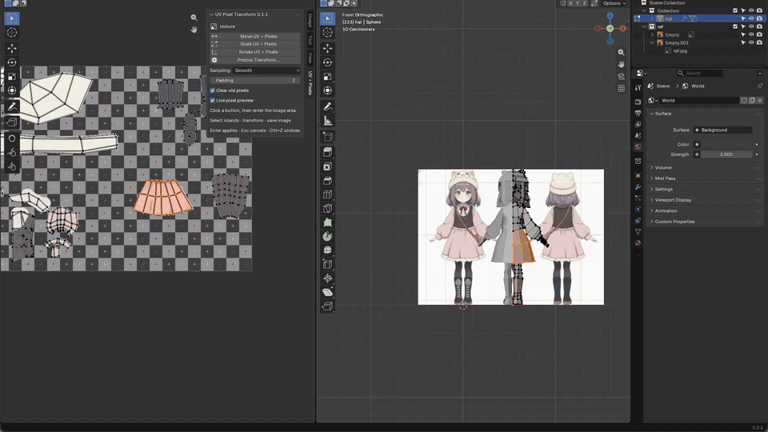

# UV Pixel Transform

Move, scale and rotate **UV islands together with their painted pixels** in Blender.

**Blender 5.2+ · GPL-3.0-or-later · v0.2.0**

[Download the extension](https://github.com/gosuni2025/uv-pixel-transform/releases/latest) · [한국어 사용법](docs/README.ko.md) · [Profiling](docs/PROFILING.md)

## Demo

[](docs/media/demo.mp4)

[Watch the 720p / 24 fps MP4](docs/media/demo.mp4). This recording shows the earlier v0.1.1 development build. The current release adds a floating GPU layer, off-canvas editing, filters and localization. Original recording: 38 MB; compressed MP4: about 0.54 MB; inline GIF: about 3.4 MB. Audio is omitted.

## A floating layer until you apply

1. Open **UV Editing**, enter **Edit Mode**, and display the painted image.
2. Select a UV island. Partial selections expand to the whole connected island.
3. Open **N → UV + Pixels** and choose a transform.
4. Bring the pointer onto the image canvas. Move the floating layer; switch with **G / S / R** to move, scale or rotate in the same operation.
5. **Enter / left-click** applies both UVs and pixels once. **Esc / right-click** discards the layer. **Ctrl+Z** undoes the applied UV and pixel changes together.
6. Save the image with **Image → Save**, then save your `.blend`.

While the layer is floating, the original image, actual UV map and 3D material remain unchanged. The preview can overlap existing artwork. With outside preview enabled, the painted layer stays visible beyond the image boundary and can be brought back before applying.

This is a temporary transform layer, not a persistent layer stack. It is baked into the image on Apply.

### Controls

| Control | Action |
| --- | --- |
| G / S / R during a transform | Switch mode without baking intermediate results |
| Type a number | Pixels for movement, factor for scaling, degrees for rotation |
| X / Y | Constrain movement; numeric movement defaults to X |
| Ctrl | Snap to pixels, 0.1 scale increments, or 15° rotation increments |
| Shift | Fine mouse adjustments |
| Mouse wheel / trackpad / middle mouse | Zoom or pan the UV view without interrupting the floating transform |
| Precise Transform… | Enter translation, scale and rotation together |
| Enter / left-click | Apply |
| Esc / right-click | Cancel |

Normal Blender G/R/S retain their normal behavior outside an add-on transform. Start with the sidebar buttons or the **UV** menu.

## Options

| Option | Behavior |
| --- | --- |
| Language | Auto, English, 한국어, 日本語, 简体中文, 繁體中文, Español |
| Sampling | Nearest, Bilinear, Bicubic (Catmull–Rom), or Lanczos (3 lobes) |
| Padding | Extend edge colors when applying, from 0–16 pixels |
| Clear old pixels on apply | **Off by default.** Keep the original artwork; enable to erase the source island when applying |
| Live pixel preview | Show the painted floating layer; disable to show its UV outline only |
| Allow outside preview | **On by default.** Continue transforming beyond the image; return the entire island inside before applying |
| Protect other islands on apply | **On by default.** Preview overlap freely, but block applying over another island. Disable explicitly to composite over it |

All filters handle transparency using premultiplied alpha. GPU previews and the final CPU rasterizer use the same kernels. Sharper filters can ring around high-contrast edges; choose Bilinear for a softer result or Nearest for pixel art. Scaling increases the allocated texture area; it cannot recover detail absent from the source.

Buttons, settings, filter names, modal hints and operational errors support all listed languages. **Auto** follows Blender; choosing a language here affects this add-on only. Native Blender dialogs and some tooltips follow Blender's own UI language.

## Install

Download **`uv_pixel_transform-0.2.0.zip`** from [Releases](https://github.com/gosuni2025/uv-pixel-transform/releases/latest).

In Blender: **Edit → Preferences → Add-ons → dropdown → Install from Disk…**, choose that ZIP and enable the extension. Use the extension ZIP, not GitHub's automatically generated source archive.

No network access or external Python dependencies are required. NumPy and the GPU API are supplied by Blender.

## Current scope

- Tested on **Blender 5.2.2 LTS, macOS/Metal**. Other operating systems and GPUs have not yet been verified.
- One mesh, one active UV map and one displayed RGBA image per operation; images up to 16 megapixels.
- Direct UV image mapping and explicit UV Map nodes are supported. Mapping-node transforms, node-group image sources, procedural materials, UDIMs, repeating UVs, sequences, movies and linked library data are not supported.
- Starting UVs must be within the 0–1 tile. Selected/unselected islands sharing the same source pixels must be selected together. Other mesh objects sharing the image need their own image first.
- sRGB and linear Rec.709 previews are supported. Custom OCIO display transforms and other source color spaces have not been validated. Tangent-space normal vectors are not reoriented.
- The layer samples the original source throughout a gesture. Repeated **applied** transforms can still accumulate normal resampling loss.
- Compressed image undo snapshots live in memory and are cleared when opening a file or disabling the extension. Save your image before disabling it. Images are never saved automatically.

## Development

```sh
python -m pip install numpy
python -m unittest discover -s tests -v
blender -b --factory-startup --python-exit-code 1 --python tests/blender_integration.py
blender --factory-startup --python tests/run_gui_tests.py
blender --command extension validate uv_pixel_transform
blender --command extension build --source-dir uv_pixel_transform --output-dir dist
```

The GUI runner starts with a factory scene and exits its own process after testing. **Never execute these scene-building tests in your working Blender document.** See [test results](docs/TEST_RESULTS.md).

The extension code is licensed under **GPL-3.0-or-later**. It was written for this project; no code was copied from other UV add-ons. Demo footage and artwork are separate from the extension's source-code license.
